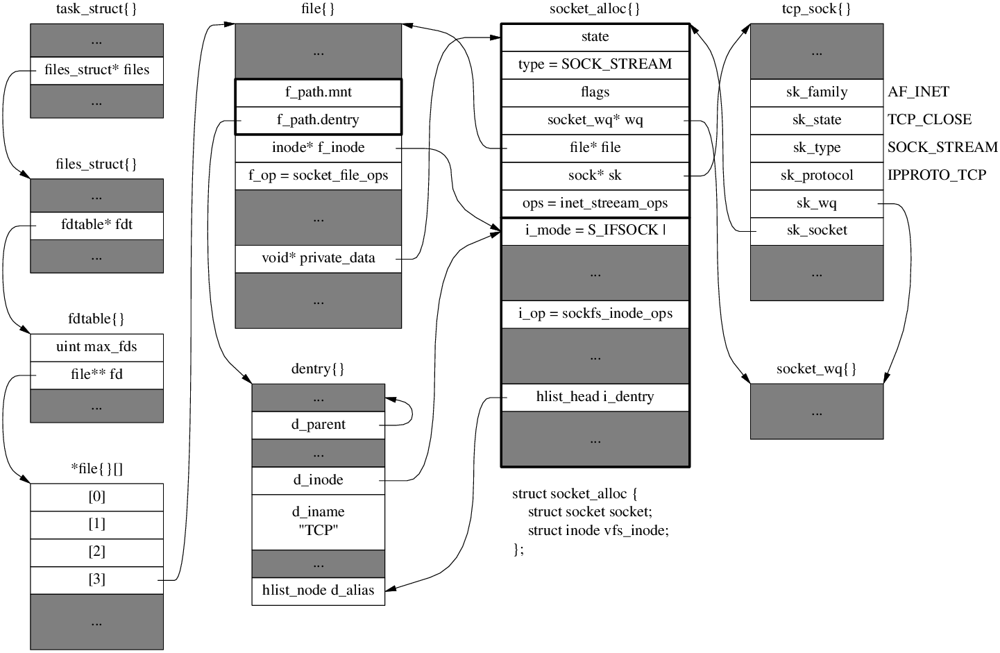
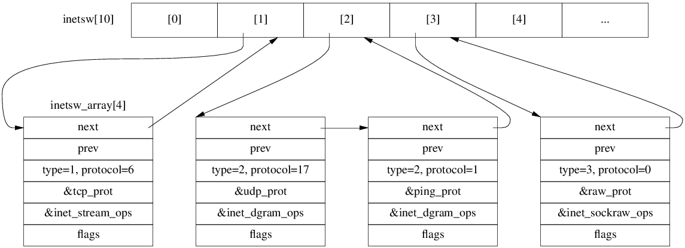
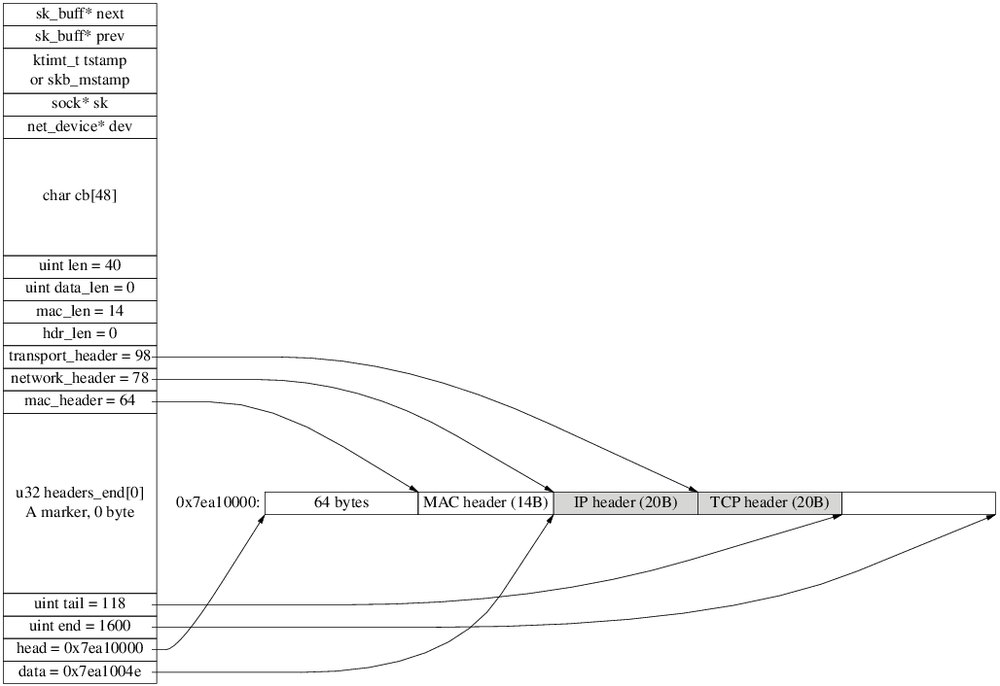

# File Descriptor Table

```c
// include/linux/sched.h

struct task_struct {
  // ...
  /* open file information */
        struct files_struct *files;
  // ...
};

// include/linux/fdtable.h

struct fdtable {
        unsigned int max_fds;
        struct file __rcu **fd;      /* current fd array */
        unsigned long *close_on_exec;
        unsigned long *open_fds;
        unsigned long *full_fds_bits;
        struct rcu_head rcu;
};

/*
 * Open file table structure
 */
struct files_struct {
  /*
   * read mostly part
   */
        atomic_t count;
        bool resize_in_progress;
        wait_queue_head_t resize_wait;

        struct fdtable __rcu *fdt;
        struct fdtable fdtab;
  /*
   * written part on a separate cache line in SMP
   */
        spinlock_t file_lock ____cacheline_aligned_in_smp;
        unsigned int next_fd;
        unsigned long close_on_exec_init[1];
        unsigned long open_fds_init[1];
        unsigned long full_fds_bits_init[1];
        struct file __rcu * fd_array[NR_OPEN_DEFAULT];
};

// include/linux/fs.h

struct file {
        union {
                struct llist_node       fu_llist;
                struct rcu_head         fu_rcuhead;
        } f_u;
        struct path             f_path;
        struct inode            *f_inode;       /* cached value */
        const struct file_operations    *f_op;

        // ...

        /* needed for tty driver, and maybe others */
        void                    *private_data;

#ifdef CONFIG_EPOLL
        /* Used by fs/eventpoll.c to link all the hooks to this file */
        struct list_head        f_ep_links;
        struct list_head        f_tfile_llink;
#endif
};

```

# `struct socket{}`

```c
// include/linux/net.h

struct socket_wq {
        /* Note: wait MUST be first field of socket_wq */
        wait_queue_head_t       wait;
        struct fasync_struct    *fasync_list;
        unsigned long           flags; /* %SOCKWQ_ASYNC_NOSPACE, etc */
        struct rcu_head         rcu;
} ____cacheline_aligned_in_smp;

/**
 *  struct socket - general BSD socket
 *  @state: socket state (%SS_CONNECTED, etc)
 *  @type: socket type (%SOCK_STREAM, etc)
 *  @flags: socket flags (%SOCK_NOSPACE, etc)
 *  @ops: protocol specific socket operations
 *  @file: File back pointer for gc
 *  @sk: internal networking protocol agnostic socket representation
 *  @wq: wait queue for several uses
 */
struct socket {
        socket_state            state;

        kmemcheck_bitfield_begin(type);
        short                   type;
        kmemcheck_bitfield_end(type);

        unsigned long           flags;

        struct socket_wq __rcu  *wq;

        struct file             *file;
        struct sock             *sk;
        const struct proto_ops  *ops;
};

// include/net/sock.h

struct socket_alloc {
        struct socket socket;
        struct inode vfs_inode;
};

// include/linux/fs.h
struct inode {
        umode_t                 i_mode;     // S_IFSOCK | S_IRWXUGO;
        unsigned short          i_opflags;
        kuid_t                  i_uid;
        kgid_t                  i_gid;
        unsigned int            i_flags;
// ...
        const struct inode_operations   *i_op;
        struct super_block      *i_sb;
// ...
        unsigned long           i_ino;      // sockfs_dname: "socket:[%lu]"
// ...
        union {
                struct hlist_head       i_dentry;
                struct rcu_head         i_rcu;
        };
// ...
};
```

# `socket(2)`

```text
int sys_socket(int family, int type, int protocol)
  -> struct socket* sock_create(family, type, protocol)
    -> __sock_create(family, type, protocol)
      -> struct socket* sock = sock_alloc()
        -> inode = new_inode_pseudo(super_block of sockfs)      // fs/inode.c
          -> alloc_inode
            -> sock_alloc_inode (sb->s_op->alloc_inod)
              -> socket_alloc *ei = kmem_cache_alloc(sock_inode_cachep)  // 306B
              -> socket_wq *wq = kmalloc(sizeof(*wq))  // 24B
              ei->socket.wq = wq;
              ei->socket.state = SS_UNCONNECTED;
            -> inode_init_always
        sock = SOCKET_I(inode);
        inode->i_op = &sockfs_inode_ops;  // .listxattr = sockfs_listxattr,
      -> net_families[family]->create(sock, protocol)
        -> inet_create(sock, protocol)                  // net/ipv4/af_inet.c
  -> sock_map_fd()
    -> get_unused_fd_flags
    -> sock_alloc_file
      -> d_alloc_pseudo  // sizeof(struct dentry) == 128
      -> file = alloc_file(..., &socket_file_ops);  // sizeof(struct file) == 140
        -> get_empty_filp
        file.f_op = &socket_file_ops
      sock->file = file;
      file->private_data = sock;
    -> fd_install

inet_create(sock, protocol)
  -> find inet_protosw for sock->type & protocol
  -> struct sock* sk = sk_alloc()
    -> sk_prot_alloc -> kmem_cache_alloc (tcp_prot is 1360B)
  -> sock_init_data
    sk->sk_socket = sock;
    sock->sk = sk;
  -> sk->sk_prot->init(sk)
    -> tcp_v4_init_sock
      -> tcp_init_sock
        -> tcp_init_xmit_timers
        -> tcp_prequeue_init
        -> tcp_enable_early_retrans
        -> tcp_assign_congestion_control
        sk->sk_state = TCP_CLOSE;
      icsk->icsk_af_ops = &ipv4_specific;
```

After `socket()`


# Memory usage

On Ubuntu 14.04, `/proc/slabinfo`

| struct | size | cache name |
| --- | --- | --- |
| `file` | 216 | "filp" |
| `dentry` | 192 | "dentry" |
| `socket_alloc` | 640 | "sock_inode_cache" |
| `tcp_sock` | 1792 | "TCP" |
| `socket_wq` | 48 | "kmalloc-64"? |
| `inet_bind_bucket` | 48 | "tcp_bind_bucket"? |

Total : 2888 bytes/socket, not including send/receive buffers. For client sockets, +48B for `inet_bind_bucket`.


# net_proto_family

| family | type | protocol |
| --- | --- | --- |
| AF_UNIX=1 | SOCK_STREAM=1 | 0
| AF_UNIX | SOCK_DGRAM=2 | 0
| AF_INET=2 | SOCK_STREAM | IPPROTO_TCP=6 |
| AF_INET | SOCK_DGRAM | IPPROTO_UDP=17 |
| AF_INET | SOCK_DGRAM | IPPROTO_ICMP=1 |
| AF_INET | SOCK_RAW=3 | IPPROTO_IP=0 |
| NPROTO=AF_MAX=41 | SOCK_MAX=11 | no max?|


```c
// include/linux/net.h
// How to create a socket for an address family
struct net_proto_family {
  int family;  // AF_INET, AF_UNIX, AF_INET6, etc. must: 0 <= family < NPROTO
  int (*create)(struct net *net, struct socket *sock, int protocol, int kern);
  struct module *owner;
};

```


```c
// net/socket.c
static const struct net_proto_family *net_families[NPROTO];

// net/ipv4/af_inet.c
static int inet_create(struct net *net, struct socket *sock, int protocol, int kern);

static const struct net_proto_family inet_family_ops = {
  .family = PF_INET,
  .create = inet_create,
  .owner  = THIS_MODULE
};

// inet_init() calls sock_register():
net_families[AF_INET] = &inet_family_ops;
```
# inet_protosw

```c
// include/net/protocol.h
/* This is used to register socket interfaces for IP protocols.  */
struct inet_protosw {
  struct list_head list;

  /* These two fields form the lookup key.  */
  unsigned short   type;     /* This is the 2nd argument to socket(2).  eg. SOCK_STREAM, SOCK_DGRAM */
  unsigned short   protocol; /* This is the L4 protocol number.  eg. IPPROTO_TCP, IPPROTO_TCP */

  struct proto           *prot;
  const struct proto_ops *ops;
  
  unsigned char    flags;      /* See INET_PROTOSW_* below.  */
};
#define INET_PROTOSW_REUSE      0x01  /* Are ports automatically reusable? */
#define INET_PROTOSW_PERMANENT  0x02  /* Permanent protocols are unremovable. */
#define INET_PROTOSW_ICSK       0x04  /* Is this an inet_connection_sock? */
```

```c
// net/ipv4/af_inet.c
/* The inetsw table contains everything that inet_create needs to
 * build a new socket.
 */
static struct list_head inetsw[SOCK_MAX];
static DEFINE_SPINLOCK(inetsw_lock);

/* Upon startup we insert all the elements in inetsw_array[] into
 * the linked list inetsw.
 */
static struct inet_protosw inetsw_array[] =
{
  {
    .type =       SOCK_STREAM,
    .protocol =   IPPROTO_TCP,
    .prot =       &tcp_prot,
    .ops =        &inet_stream_ops,
    .flags =      INET_PROTOSW_PERMANENT | INET_PROTOSW_ICSK,
  },
  {
    .type =       SOCK_DGRAM,
    .protocol =   IPPROTO_UDP,
    .prot =       &udp_prot,
    .ops =        &inet_dgram_ops,
    .flags =      INET_PROTOSW_PERMANENT,
  },
  {
    .type =       SOCK_DGRAM,
    .protocol =   IPPROTO_ICMP,
    .prot =       &ping_prot,
    .ops =        &inet_dgram_ops,
    .flags =      INET_PROTOSW_REUSE,
  },
  {
    .type =       SOCK_RAW,
    .protocol =   IPPROTO_IP,        /* wild card */
    .prot =       &raw_prot,
    .ops =        &inet_sockraw_ops,
    .flags =      INET_PROTOSW_REUSE,
  }
};

#define INETSW_ARRAY_LEN ARRAY_SIZE(inetsw_array)

// inet_init()
  sock_register(&inet_family_ops);

  /* Register the socket-side information for inet_create. */
  for (struct list_head *r = &inetsw[0]; r < &inetsw[SOCK_MAX]; ++r)
    INIT_LIST_HEAD(r);

  for (struct inet_protosw *q = inetsw_array; q < &inetsw_array[INETSW_ARRAY_LEN]; ++q)
    inet_register_protosw(q);
```

After Initialization:


# skbuff
A sample of receive skb for TCP SYN segment:



